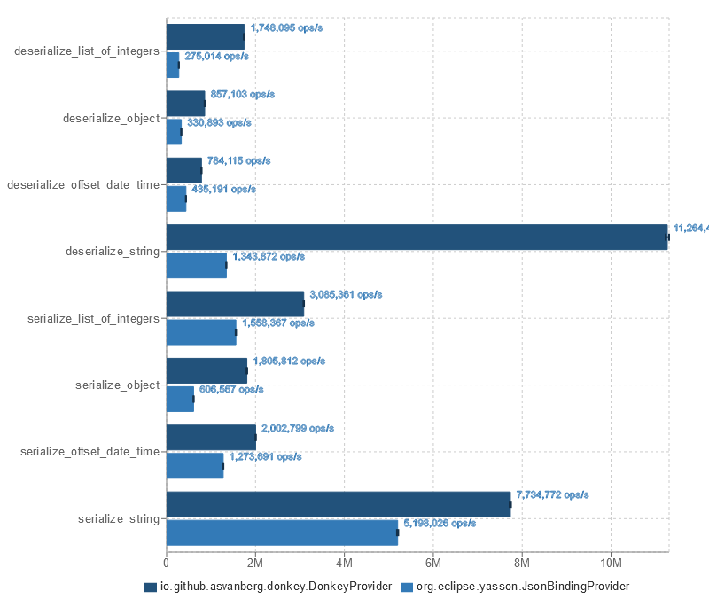

[](https://github.com/asvanberg/donkey/actions/workflows/maven.yaml)
[](https://codecov.io/gh/asvanberg/donkey)

# Donkey
Opinionated implementation of the [Jakarta JSON binding API](https://github.com/eclipse-ee4j/jsonb-api).
It is *not* spec compliant and requires explicit configuration with annotations
rather than relying on naming conventions or the Java Beans specification.

## Motivation
Why explicit configuration? Because I want to maximize the freedom of being able to refactor your code as
required without fear of breakage. If the application relies on naming conventions there is a much higher chance of
something breaking when refactoring. It also clearly communicates intent when a method is annotated with
`@JsonbProperty("name")`
that it will be included in the JSON output rather than just seeing a method called `getName()`.
There is also the possibility to designate `@JsonbProperty` as "methods annotated with this are used" which can improve
the feedback your IDE can provide instead of potentially falsely marking it as unused.

## Requirements
**Java 17**.
This library uses reflection so your classes used for (de-)serialization must therefore be at least opened in their module definition.

## Usage
Write your application against the Jakarta JSON binding API. Make Donkey available during runtime, and it will be used
as the provider. 
An implementation of [Jakarta JSON processing](https://github.com/eclipse-ee4j/jsonp) must also be available during runtime.

### Annotation processing
Donkey comes with an annotation processing module located at `io.github.asvanberg:donkey-apt`.
It is *highly* recommended using this module as it increases serialization performance.

If you are building a modular application you have to explicitly configure the annotation processor by adding the
artifact coordinates to the Maven compiler configuration using [annotation processor paths](https://maven.apache.org/plugins/maven-compiler-plugin/compile-mojo.html#annotationProcessorPaths).
You also need to add `requires static io.github.asvanberg.donkey.apt` to `module-info.java`.

Non-modular apps requires no extra configuration besides adding the provided dependency.

### Maven
```xml
<dependencies>
  <dependency>
    <groupId>io.github.asvanberg</groupId>
    <artifactId>donkey</artifactId>
    <version>1.3.0-SNAPSHOT</version>
  </dependency>
  <dependency>
    <groupId>io.github.asvanberg</groupId>
    <artifactId>donkey-apt</artifactId>
    <version>1.3.0-SNAPSHOT</version>
    <scope>provided</scope>
  </dependency>
</dependencies>
```
### Java Platform Module System
```
requires io.github.asvanberg.donkey;
requires static io.github.asvanberg.donkey.apt
```

## Serializing
When serializing objects only public methods annotated with [`@JsonbProperty`](https://javadoc.io/static/jakarta.json.bind/jakarta.json.bind-api/2.0.0/jakarta/json/bind/annotation/JsonbProperty.html)
and whose [`value`](https://javadoc.io/static/jakarta.json.bind/jakarta.json.bind-api/2.0.0/jakarta/json/bind/annotation/JsonbProperty.html#value())
is explicitly set will be included in the JSON.

Empty `Optional` and `null` values will not be included in the JSON output unless [`@JsonbProperty#nillable`](https://javadoc.io/static/jakarta.json.bind/jakarta.json.bind-api/2.0.0/jakarta/json/bind/annotation/JsonbProperty.html#nillable())
is set to true.

## Deserializing
When deserializing objects they must have a constructor or static method annotated with [`@JsonbCreator`](https://javadoc.io/static/jakarta.json.bind/jakarta.json.bind-api/2.0.0/jakarta/json/bind/annotation/JsonbCreator.html)
and all parameters must be annotated with `@JsonbProperty` and have an explicit `value` set.

`null` in JSON will only be deserialized into `String`, `Optional`, or `@JsonbCreator`objects, other types will fail.

## Supported features
* (De-)serialization of the following;
  * Primitives (and wrappers)
  * `String`
  * `java.time.{Instant, LocalDate, LocalTime, LocalDateTime, OffsetDateTime}` (using their respective ISO formats)
  * `List<E>` and `Collection<E>`
  * `Map<String, E>`
  * `Optional` (and primitive specializations)
  * Enums
  * `java.net.URI`
  * `java.util.UUID`
  * Other types (**including records**) are treated as annotated objects according to the above paragraphs
* [`@JsonbDateFormat`](https://javadoc.io/static/jakarta.json.bind/jakarta.json.bind-api/2.0.0/jakarta/json/bind/annotation/JsonbDateFormat.html) (`Instant` only supports the special case [TIME_IN_MILLIS](https://javadoc.io/static/jakarta.json.bind/jakarta.json.bind-api/2.0.0/jakarta/json/bind/annotation/JsonbDateFormat.html#TIME_IN_MILLIS))
* Type-level [`@JsonbTypeAdapter`](https://javadoc.io/static/jakarta.json.bind/jakarta.json.bind-api/2.0.0/jakarta/json/bind/annotation/JsonbTypeAdapter.html)
* Configured [`JsonbAdapters`](https://javadoc.io/static/jakarta.json.bind/jakarta.json.bind-api/2.0.0/jakarta/json/bind/adapter/JsonbAdapter.html)
* Locale configuration which is relevant for certain date formats

## Benchmark
Using Donkey 1.3.0-SNAPSHOT (with annotation processing) and Yasson 2.0.2.


### Running the benchmark
```
mvnw -f benchmark/pom.xml clean package
java -jar benchmark/target/benchmarks.jar
```
